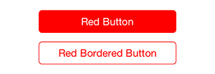

# LEFlatButton

[](https://travis-ci.org/efremidze/LEFlatButton)
[](http://cocoapods.org/pods/LEFlatButton)
[](http://cocoapods.org/pods/LEFlatButton)
[](http://cocoapods.org/pods/LEFlatButton)

## Overview

`LEFlatButton` is a `UIButton` subclass with a flat style




## Usage

### Installation

LEFlatButton is available through [CocoaPods](http://cocoapods.org). To install
it, simply add the following line to your Podfile:

```ruby
pod "LEFlatButton"
```

### Example

```objectivec
LEFlatButton *button = [[LEFlatButton alloc] initWithFrame:(CGRect){0, 0, 240, 40}];
button.layer.cornerRadius = 6.0f;
button.layer.masksToBounds = YES;
button.backgroundColor = [UIColor redColor];
[button setFlatTitle:@"Red Button"];
[self.view addSubview:button];
```

## License

LEFlatButton is available under the MIT license. See the LICENSE file for more info.
